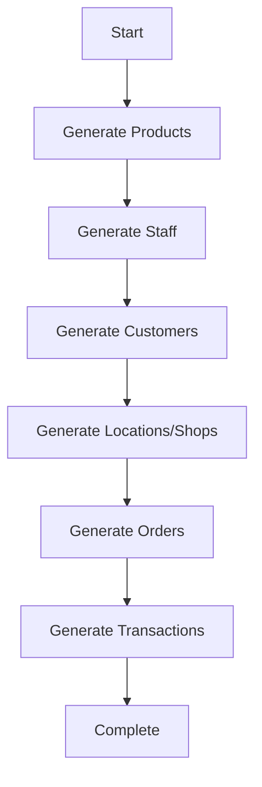

# 🛒 TechStore Vietnam - Unified API Simulator v3.0

Complete e-commerce and retail data simulation with **granular generation control** and **standardized responses**.

## 🎯 What's New in v3.0

### ✨ Granular Data Generation
Generate exactly what you need:
- ✅ `/generate/products` - Generate 100-5,000 products
- ✅ `/generate/customers` - Generate 1K-5M customers
- ✅ `/generate/staff` - Generate 50-1,000 staff
- ✅ `/generate/orders` - Generate channel-specific orders
- ✅ `/generate/locations` - Generate Vietnam store locations
- ✅ `/generate/shops` - Generate international shops
- ✅ `/generate/all` - Generate everything at once

### 📋 Standardized Response Format
Every endpoint returns consistent structure:
```json
{
  "status": "success",  // or "error", "warning"
  "msg": "Operation completed successfully",
  "data": { ... },
  "count": 50,  // optional
  "page": 1,    // optional  
  "total": 1000 // optional
}
```

### 🔗 Data Consistency
All routers share the same master data:
- Products generated once, used everywhere
- Customer IDs consistent across channels
- Staff shared across all locations
- Transaction IDs link all systems

## 📁 Project Structure

```
techstore-api-simulator/
├── main.py                          # Unified FastAPI (Port 8000)
├── requirements.txt
├── README.md
│
├── shared/
│   ├── __init__.py
│   └── data_generator.py           # Shared master data
│
├── routers/
│   ├── __init__.py
│   ├── shopify_router.py           # /shopify/* endpoints
│   ├── paypal_router.py            # /paypal/* endpoints
│   ├── mercury_router.py           # /mercury/* endpoints
│   ├── sapo_router.py              # /sapo/* endpoints
│   └── odoo_router.py              # /odoo/* endpoints
│
└── shared_data/                     # Generated data
    ├── products.json.gz            # 1000 tech products
    ├── staff.json.gz               # 300 staff members
    ├── sapo_locations.json.gz      # 50 Vietnam stores
    ├── odoo_shops.json.gz          # 30 international shops
    ├── customers/                  # 2M customers (batched)
    ├── shopify_orders/             # 6M orders
    ├── sapo_orders/                # 1M orders
    ├── odoo_orders/                # 800K orders
    ├── paypal_transactions/        # Payment data
    └── mercury_transactions/       # Banking data
```

## 🚀 Quick Start

### 1. Installation
```bash
pip install -r requirements.txt
python main.py
```

### 2. Access Documentation
- **Swagger UI**: http://localhost:8000/docs
- **ReDoc**: http://localhost:8000/redoc

### 3. Generate Data Step-by-Step

```bash
# Step 1: Generate shared master data (required first)
curl -X POST "http://localhost:8000/shopify/generate/products?count=1000"
curl -X POST "http://localhost:8000/shopify/generate/staff?count=300"
curl -X POST "http://localhost:8000/shopify/generate/customers?count=2000000"

# Step 2: Generate locations/shops for POS systems
curl -X POST "http://localhost:8000/sapo/generate/locations?count=50"
curl -X POST "http://localhost:8000/odoo/generate/shops?count=30"

# Step 3: Generate orders for each channel
curl -X POST "http://localhost:8000/shopify/generate/orders"
curl -X POST "http://localhost:8000/sapo/generate/orders"
curl -X POST "http://localhost:8000/odoo/generate/orders"

# Step 4: Generate payment data
curl -X POST "http://localhost:8000/paypal/generate/transactions"
curl -X POST "http://localhost:8000/mercury/generate/transactions"

# OR: Generate everything at once
curl -X POST "http://localhost:8000/shopify/generate/all"
```

## 📊 Generation Endpoints by Router

### Shopify (`/shopify/generate/*`)
```bash
# Master data (generates for all systems)
POST /shopify/generate/products?count=1000
POST /shopify/generate/customers?count=2000000
POST /shopify/generate/staff?count=300

# Shopify-specific
POST /shopify/generate/orders

# Generate everything
POST /shopify/generate/all

# Check status
GET /shopify/generate/status
```

**Response Example:**
```json
{
  "status": "success",
  "msg": "Successfully generated 1000 products",
  "data": {
    "generated": 1000,
    "sample": [
      {
        "id": 1,
        "name": "Laptop ASUS ROG Gaming i7 16GB RAM",
        "price_vnd": 25000000,
        "price_usd": 1041.67
      }
    ]
  },
  "count": 1000
}
```

### PayPal (`/paypal/generate/*`)
```bash
POST /paypal/generate/transactions?count=300
GET /paypal/generate/status
```

**Response Example:**
```json
{
  "status": "success",
  "msg": "Successfully generated 300 PayPal transactions",
  "data": {
    "generated": 300,
    "estimated_time": "< 1 minute"
  },
  "count": 300
}
```

### Mercury Bank (`/mercury/generate/*`)
```bash
POST /mercury/generate/accounts?count=3
POST /mercury/generate/transactions?count=500
POST /mercury/generate/all
GET /mercury/generate/status
```

### Sapo POS (`/sapo/generate/*`)
```bash
# Sapo-specific
POST /sapo/generate/locations?count=50

# Orders (requires products, staff, locations)
POST /sapo/generate/orders

# Generate all Sapo data
POST /sapo/generate/all

GET /sapo/generate/status
```

### Odoo POS (`/odoo/generate/*`)
```bash
# Odoo-specific
POST /odoo/generate/shops?count=30
POST /odoo/generate/sessions

# Orders (requires products, staff, shops, sessions)
POST /odoo/generate/orders

# Generate all Odoo data
POST /odoo/generate/all

GET /odoo/generate/status
```

## 📋 Standard Response Format

All endpoints follow this structure:

### Success Response
```json
{
  "status": "success",
  "msg": "Orders retrieved successfully",
  "data": [ /* array of orders */ ],
  "count": 50,
  "page": 1,
  "total": 6000000
}
```

### Error Response
```json
{
  "status": "error",
  "msg": "Products must be generated first before orders",
  "data": null
}
```

### Warning Response
```json
{
  "status": "warning",
  "msg": "Products already generated. Delete existing data to regenerate.",
  "data": {
    "count": 1000
  },
  "count": 1000
}
```

## 🔄 Data Generation Workflow

### Recommended Order



### Step-by-Step Guide

#### Step 1: Master Data (Required First)
```bash
# These are shared across ALL systems
curl -X POST "http://localhost:8000/shopify/generate/products?count=1000"
curl -X POST "http://localhost:8000/shopify/generate/staff?count=300"
curl -X POST "http://localhost:8000/shopify/generate/customers?count=2000000"
```

**Why first?**
- Products: Used in all orders (Shopify, Sapo, Odoo)
- Staff: Used in retail operations (Sapo, Odoo)
- Customers: Referenced in all orders

#### Step 2: Location-Specific Data
```bash
# For Sapo POS (Vietnam)
curl -X POST "http://localhost:8000/sapo/generate/locations?count=50"

# For Odoo POS (International)
curl -X POST "http://localhost:8000/odoo/generate/shops?count=30"
curl -X POST "http://localhost:8000/odoo/generate/sessions"

# For Mercury Bank
curl -X POST "http://localhost:8000/mercury/generate/accounts?count=3"
```

#### Step 3: Generate Orders
```bash
# Online orders
curl -X POST "http://localhost:8000/shopify/generate/orders"

# Offline Vietnam
curl -X POST "http://localhost:8000/sapo/generate/orders"

# Offline International
curl -X POST "http://localhost:8000/odoo/generate/orders"
```

#### Step 4: Generate Payment Data
```bash
curl -X POST "http://localhost:8000/paypal/generate/transactions?count=300"
curl -X POST "http://localhost:8000/mercury/generate/transactions?count=500"
```

## 💡 Usage Examples

### Check What's Generated
```bash
# Check overall status
curl http://localhost:8000/shopify/generate/status

# Response:
{
  "status": "success",
  "msg": "Generation status retrieved",
  "data": {
    "products": {
      "generated": true,
      "count": 1000
    },
    "customers": {
      "generated": true,
      "count": 2000000
    },
    "staff": {
      "generated": true,
      "count": 300
    },
    "orders": {
      "generated": 1500000,
      "target": 6000000,
      "completed": false
    },
    "is_generating": true
  }
}
```

### Query Generated Data
```bash
# Get products
curl "http://localhost:8000/shopify/admin/api/2024-01/products?limit=10"

# Response:
{
  "status": "success",
  "msg": "Products retrieved successfully",
  "data": [
    {
      "id": 1,
      "name": "Laptop ASUS ROG Gaming i7 16GB RAM",
      "sku": "TECH-1234-ABC",
      "price_vnd": 25000000,
      "price_usd": 1041.67,
      "category": "Laptop",
      "brand": "ASUS"
    }
  ],
  "count": 10,
  "total": 1000
}
```

### Handle Errors Gracefully
```bash
# Try to generate orders before products
curl -X POST "http://localhost:8000/shopify/generate/orders"

# Response:
{
  "status": "error",
  "msg": "Products must be generated first before orders",
  "data": null
}
```

### Python Integration
```python
import requests

BASE_URL = "http://localhost:8000"

def generate_data():
    """Generate all data with proper error handling"""
    
    # Step 1: Products
    resp = requests.post(f"{BASE_URL}/shopify/generate/products?count=1000")
    result = resp.json()
    
    if result["status"] == "success":
        print(f"✓ {result['msg']}")
    else:
        print(f"✗ {result['msg']}")
        return
    
    # Step 2: Staff
    resp = requests.post(f"{BASE_URL}/shopify/generate/staff?count=300")
    result = resp.json()
    print(f"✓ {result['msg']}")
    
    # Step 3: Customers (background)
    resp = requests.post(f"{BASE_URL}/shopify/generate/customers?count=2000000")
    result = resp.json()
    print(f"✓ {result['msg']}")
    
    # Step 4: Orders (background)
    resp = requests.post(f"{BASE_URL}/shopify/generate/orders")
    result = resp.json()
    print(f"✓ {result['msg']}")

def query_data():
    """Query data with standard response handling"""
    
    # Get products
    resp = requests.get(f"{BASE_URL}/shopify/admin/api/2024-01/products?limit=50")
    result = resp.json()
    
    if result["status"] == "success":
        products = result["data"]
        print(f"Retrieved {result['count']} of {result['total']} products")
        
        for product in products:
            print(f"- {product['name']}: {product['price_vnd']:,} VND")
    else:
        print(f"Error: {result['msg']}")

# Generate all data
generate_data()

# Wait for generation to complete (check status)
import time
while True:
    resp = requests.get(f"{BASE_URL}/shopify/generate/status")
    status = resp.json()
    
    if status["data"]["orders"]["completed"]:
        print("✓ All data generated!")
        break
    
    print(f"Progress: {status['data']['orders']['generated']:,} / {status['data']['orders']['target']:,}")
    time.sleep(10)

# Query the data
query_data()
```

## 🎯 Data Consistency Examples

### Scenario 1: Cross-Channel Customer Purchase

```bash
# Customer #12345 buys online
GET /shopify/admin/api/2024-01/orders?customer_id=12345

{
  "status": "success",
  "data": [{
    "customer_id": 12345,
    "customer_name": "Nguyễn Văn Hùng",
    "order_date": "2024-11-01",
    "channel": "online"
  }]
}

# Same customer #12345 buys in store
GET /sapo/admin/orders?customer_id=12345

{
  "status": "success",
  "data": [{
    "customer_id": 12345,
    "customer_name": "Nguyễn Văn Hùng",
    "order_date": "2024-11-05",
    "channel": "retail_offline"
  }]
}
```

### Scenario 2: Payment Reconciliation

```bash
# Order with transaction ID
GET /shopify/admin/api/2024-01/orders/123456

{
  "status": "success",
  "data": {
    "id": 123456,
    "transaction_id": "TXN20241110001234567",
    "total_usd": 125.50,
    "payment_gateway": "paypal"
  }
}

# Find matching PayPal transaction
GET /paypal/v1/reporting/transactions?transaction_id=TXN20241110001234567

{
  "status": "success",
  "data": [{
    "transaction_id": "TXN20241110001234567",
    "amount": 125.50,
    "fee": 4.56,
    "status": "COMPLETED"
  }]
}

# Find bank deposit
GET /mercury/api/v1/transactions?transaction_id=TXN20241110001234567

{
  "status": "success",
  "data": [{
    "transaction_id": "TXN20241110001234567",
    "amount": 120.94,
    "kind": "incomingAch",
    "status": "posted"
  }]
}
```

## 🐛 Troubleshooting

### Issue: "Products must be generated first"
**Solution:** Always generate products before orders
```bash
curl -X POST "http://localhost:8000/shopify/generate/products?count=1000"
```

### Issue: "Already generated" warning
**Solution:** Delete existing data or accept current data
```bash
# Delete and regenerate
rm -rf shared_data/products.json.gz
curl -X POST "http://localhost:8000/shopify/generate/products?count=1000"
```

### Issue: Generation stuck or slow
**Solution:** Check status endpoint
```bash
curl "http://localhost:8000/shopify/generate/status"

# If stuck, restart application
# Ctrl+C, then: python main.py
```

## 📚 API Reference

### All Generation Endpoints

| Endpoint | Method | Parameters | Description |
|----------|--------|------------|-------------|
| `/shopify/generate/products` | POST/GET | `count` (100-5000) | Generate products |
| `/shopify/generate/customers` | POST/GET | `count` (1K-5M) | Generate customers |
| `/shopify/generate/staff` | POST/GET | `count` (50-1000) | Generate staff |
| `/shopify/generate/orders` | POST/GET | - | Generate orders |
| `/shopify/generate/all` | POST/GET | - | Generate all |
| `/shopify/generate/status` | GET | - | Check status |
| `/paypal/generate/transactions` | POST/GET | `count` (10-1000) | Generate transactions |
| `/mercury/generate/accounts` | POST/GET | `count` (1-10) | Generate accounts |
| `/mercury/generate/transactions` | POST/GET | `count` (10-5000) | Generate transactions |
| `/sapo/generate/locations` | POST/GET | `count` (10-100) | Generate locations |
| `/sapo/generate/orders` | POST/GET | - | Generate orders |
| `/odoo/generate/shops` | POST/GET | `count` (10-50) | Generate shops |
| `/odoo/generate/sessions` | POST/GET | - | Generate sessions |
| `/odoo/generate/orders` | POST/GET | - | Generate orders |

## 🎉 Summary

**v3.0 Improvements:**
- ✅ Granular control over data generation
- ✅ Standardized response format
- ✅ Better error handling
- ✅ Data consistency across all systems
- ✅ Step-by-step generation workflow
- ✅ Status checking for all entities
- ✅ Flexible configuration (counts, targets)

**Ready to build your data pipeline!** 🚀